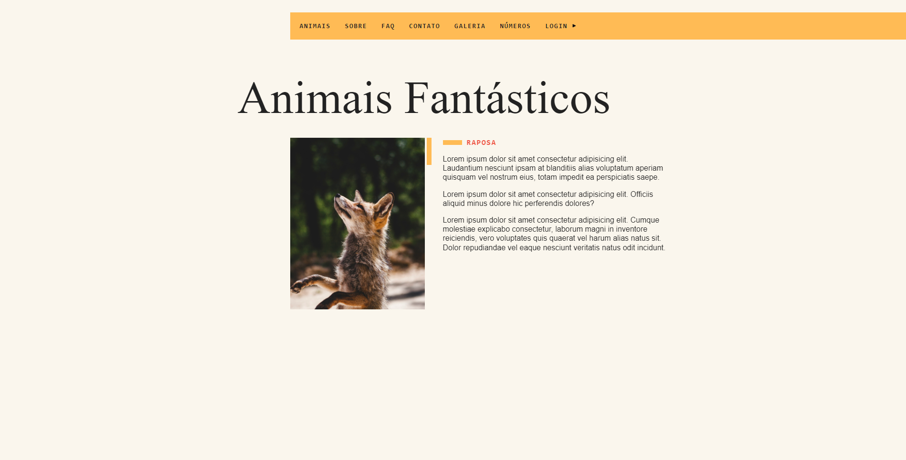

<div align="center">
  
</div>

# Animais Fantásticos
# :fox_face: Sobre o Projeto
Projeto fictício realizado durante o curso de JavaScript Completo ES6 da Origamid, consiste em um site para exibir alguns animais fantasticos que habitam no planeta.

#⚡ Tecnologias
Desenvolvido com as seguintes ferramentas:

* HTML5
* CSS3
* JavaScript
* NodeJs
* Webpack
* Eslint
* Babel

## :point_right: Como executar o projeto
```
- Clone o repositório:
$ git clone https://github.com/heyanaclara/animais-fantasticos.git

- Entre no diretório:
$ cd bikcraft

- Instale as dependências:
  # com npm
    $ npm install

  # com yarn
    $ yarn install

- Inicie o projeto com o comando:
  # com npm
    $ npm run dev

  # com yarn
    $ yarn run dev
```
[:mortar_board: Certificado do Curso](https://www.origamid.com/certificate/bd7f3bf4/)

## :memo: Licença
Esse projeto está sob a licença MIT. Veja o arquivo [LICENSE](LICENSE.md) para mais detalhes.